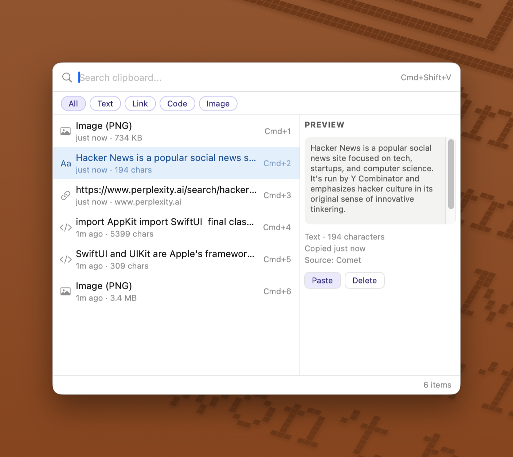
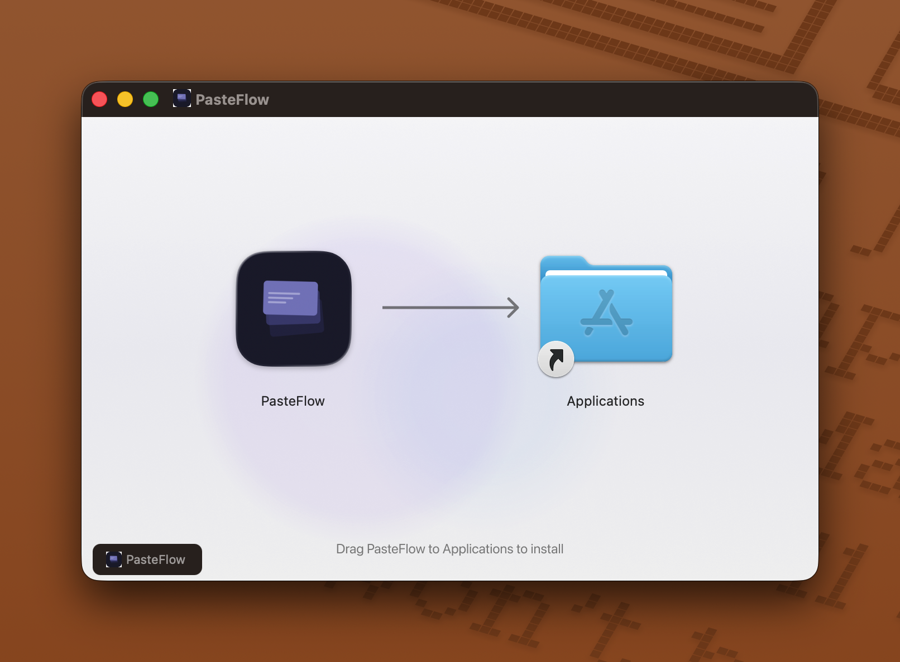

<p align="center">
  
</p>

<h1 align="center">PasteFlow</h1>

<p align="center">Smooth, flowing clipboard history on macOS — free and open source.</p>



## Features

- **Instant access** — press `Cmd+Shift+V` to open your clipboard history from anywhere
- **Smart categorization** — text, code, links, and images are auto-detected and tagged
- **Search & filter** — find any copied item instantly with search or filter by type (Tab to cycle filters)
- **Quick paste** — select an item and press Enter to paste directly into your app
- **Keyboard-first** — arrow keys to navigate, `Cmd+1`–`9` to quick-paste, Esc to dismiss
- **Image support** — screenshots and copied images stored in original format (PNG, TIFF, JPEG, etc.)
- **Lightweight** — lives in your menu bar, no Dock icon, stays out of your way
- **Privacy-first** — all data stored locally, nothing leaves your Mac
- **Configurable retention** — keep history for 7 to 90 days

## Install

### Download

Download the latest `.dmg` from [Releases](https://github.com/h3n4l/PasteFlow/releases), open it, and drag PasteFlow to Applications.



### First Launch

1. Open PasteFlow from Applications
2. Grant **Accessibility** permission when prompted (required for auto-paste)
3. PasteFlow appears in your menu bar — press `Cmd+Shift+V` to get started

### Bypass Gatekeeper

> [!IMPORTANT]
> Since PasteFlow is not notarized with Apple, macOS will block it on first launch. After dragging to Applications, open **Terminal** (search "Terminal" in Spotlight or find it in Applications → Utilities) and paste this command:
> ```bash
> sudo xattr -rd com.apple.quarantine /Applications/PasteFlow.app
> ```
> Press Enter and type your Mac password when prompted. You only need to do this once.

## Usage

| Shortcut | Action |
|---|---|
| `Cmd+Shift+V` | Open / close PasteFlow |
| `↑` / `↓` | Navigate items |
| `Enter` | Paste selected item |
| `Cmd+1` – `Cmd+9` | Quick paste Nth item |
| `Tab` | Cycle filter (All → Text → Link → Code → Image) |
| `Esc` | Dismiss |
| Type anything | Search your clipboard history |

## Requirements

- macOS 13.0 (Ventura) or later
- Accessibility permission (for paste simulation)

## Build from Source

```bash
# Clone
git clone https://github.com/h3n4l/PasteFlow.git
cd PasteFlow

# Build
xcodebuild -project PasteFlow.xcodeproj -scheme PasteFlow -configuration Release build

# Or open in Xcode
open PasteFlow.xcodeproj
```

### Create DMG

```bash
brew install create-dmg
./scripts/create-dmg.sh
```

## Tech Stack

- **Swift 5** + **SwiftUI** — all UI
- **AppKit** — NSPanel for floating window, Carbon API for global hotkey
- **GRDB** (SQLite) — clipboard history persistence
- **CGEvent** — paste simulation

## License

[GPL-3.0](LICENSE)

## Contributing

Contributions are welcome! Feel free to open issues or submit pull requests.
